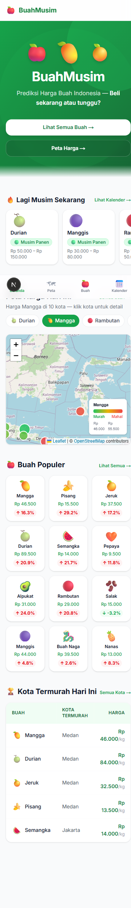
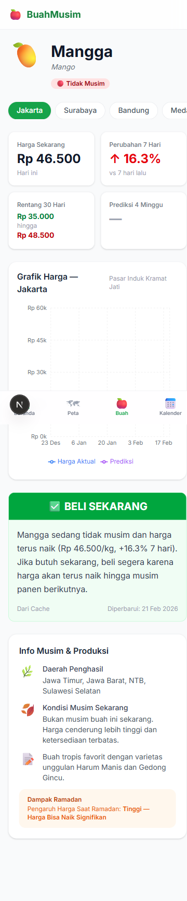
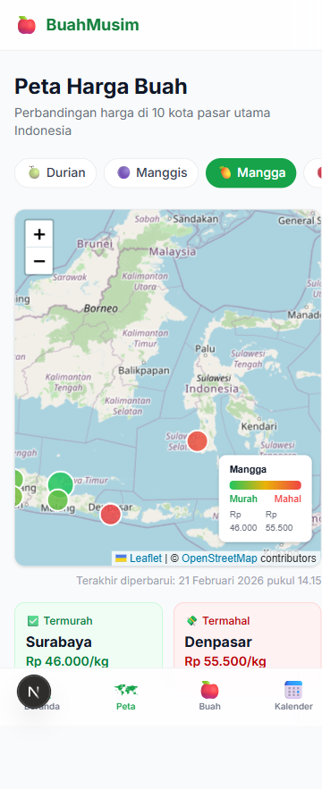
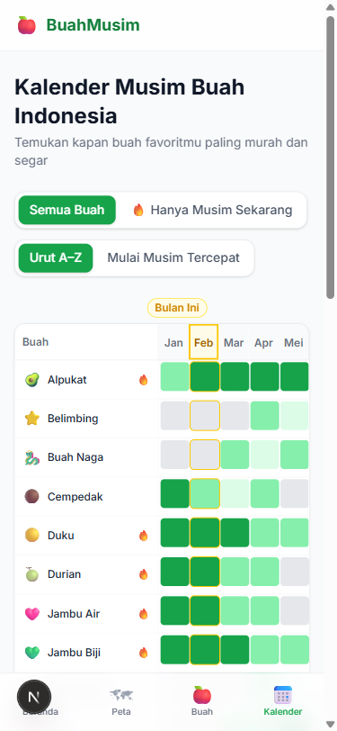
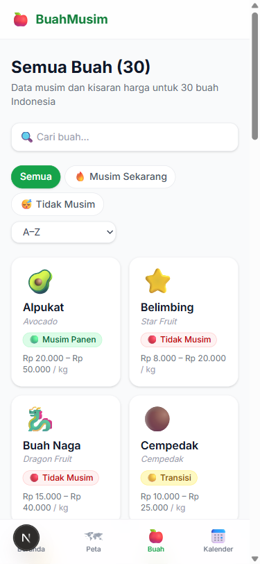
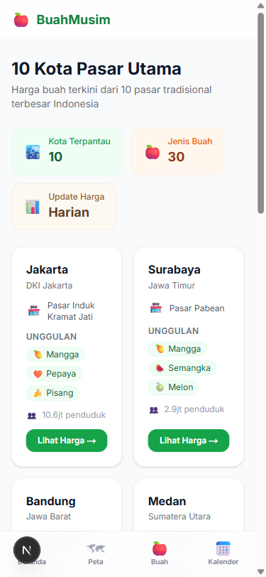

<div align="center">


# BuahMusim 🍎

### Indonesian Fruit Price Intelligence Platform

**_Beli sekarang atau tunggu? — Buy now or wait?_**

[](https://nextjs.org/)
[](https://typescriptlang.org/)
[](https://python.org/)
[](https://tailwindcss.com/)
[](https://docker.com/)
[](https://sqlite.org/)
[](LICENSE)

<br/>

[**Report Bug**](https://github.com/vaskoyudha/BuahMusim/issues/new?template=bug_report.md) · [**Request Feature**](https://github.com/vaskoyudha/BuahMusim/issues/new?template=feature_request.md) · [**Contributing**](CONTRIBUTING.md)

</div>

---

## 📸 Screenshots

<table>
  <tr>
    <td width="50%">
      
      <p align="center"><strong>Home Page</strong> — Hero, In-Season Fruits &amp; Price Map</p>
    </td>
    <td width="50%">
      
      <p align="center"><strong>Fruit Detail</strong> — Chart, Forecast &amp; AI Recommendation</p>
    </td>
  </tr>
  <tr>
    <td width="50%">
      
      <p align="center"><strong>Price Map</strong> — Cheapest cities per fruit at a glance</p>
    </td>
    <td width="50%">
      
      <p align="center"><strong>Seasonal Calendar</strong> — 12-month harvest grid</p>
    </td>
  </tr>
  <tr>
    <td width="50%">
      
      <p align="center"><strong>Fruit Catalogue</strong> — 30 fruits with season badges</p>
    </td>
    <td width="50%">
      
      <p align="center"><strong>Cities</strong> — 10 major Indonesian market cities</p>
    </td>
  </tr>
</table>

---

## 🌟 What is BuahMusim?

BuahMusim (**Buah** = fruit, **Musim** = season) is an Indonesian fruit price intelligence platform that helps consumers decide whether to buy their favorite fruit today or wait for a better price. The app tracks daily prices across **10 major Indonesian cities** for **30 seasonal fruits**, uses Facebook's Prophet time-series model for **28-day price forecasts**, and leverages LLM analysis (Groq/Llama-3.3) to generate plain-language buy/wait recommendations in Bahasa Indonesia.

The core insight is simple: Indonesian fruit prices are **highly seasonal**. Durian in January costs half as much as in August. Mangga peaks in September–November. Without price history, consumers overpay. BuahMusim makes this knowledge accessible with an intuitive, mobile-friendly interface.

The system is built as a **full-stack monorepo**: a Next.js 15 web app handles the UI and REST API, a Python FastAPI ML service runs Prophet models for predictions, and a SQLite database stores price history and cached recommendations. Everything spins up with a single `docker compose up` command.

---

## ✨ Features

- 📈 **Price History Charts** — 30/60/90-day interactive price charts per fruit per city using Recharts
- 🔮 **28-Day Forecasts** — Prophet ML model predictions with confidence intervals
- 🤖 **AI Recommendations** — "Beli" or "Tunggu" advice generated by Llama-3.3-70B via Groq API (with template fallback when API key is absent)
- 🗺️ **Price Map** — Interactive Leaflet map showing cheapest cities for each fruit at a glance
- 🕐 **Price Ticker** — Auto-scrolling live price feed for all 30 fruits
- 📊 **Seasonality Indicators** — Visual season badges (musim puncak / biasa / paceklik) per fruit
- 🏥 **Health Endpoint** — `/api/health` for monitoring DB and ML service status
- ⚡ **Daily Price Generation** — Automatic price seeding via `node-cron` — no external data feed required
- 🐳 **Docker-first** — Single `docker compose up --build` for full local stack

---

## 🏗️ Architecture

### Tech Stack

| Layer | Technology | Why Chosen |
|-------|------------|------------|
| Web Framework | Next.js 15 (App Router) | RSC + API routes in one deploy; standalone output for Docker |
| Styling | Tailwind CSS v4 | CSS-native `@theme {}` config; no JS config file overhead |
| Charts | Recharts 3 | React-native, lightweight, excellent TypeScript types |
| Map | React-Leaflet 5 | Industry standard for interactive maps; SSR-friendly with dynamic import |
| Database | SQLite via better-sqlite3 | Zero-ops, synchronous, perfect for single-server read-heavy workloads |
| ML Service | Python + FastAPI + Prophet | Prophet handles seasonality natively; FastAPI for fast async HTTP |
| LLM | Groq API (Llama-3.3-70B) | Sub-second inference latency; free tier sufficient; graceful fallback |
| Monorepo | pnpm workspaces | Native workspace protocol; fast installs; shared `@buahmusim/shared` package |
| Scheduling | node-cron | Lightweight in-process scheduler for daily price generation |
| Containerization | Docker Compose | Service orchestration for web + ML with persistent data volume |

### System Diagram (ASCII)

```
┌─────────────────────────────────────────────────────────┐
│                        Browser                          │
│          http://localhost:3000                          │
└──────────────────────┬──────────────────────────────────┘
                       │ HTTP / Next.js App Router
┌──────────────────────▼──────────────────────────────────┐
│                   Next.js App (Port 3000)                │
│                                                          │
│  ┌──────────────┐  ┌────────────────┐  ┌─────────────┐  │
│  │  React Pages │  │  API Routes    │  │  node-cron  │  │
│  │  /           │  │  /api/prices   │  │  (daily     │  │
│  │  /buah/[id]  │  │  /api/predict  │  │   seed)     │  │
│  │  /peta       │  │  /api/rekom    │  └─────────────┘  │
│  └──────────────┘  │  /api/health   │                   │
│                    └───────┬────────┘                   │
│                            │                            │
│                    ┌───────▼────────┐                   │
│                    │   SQLite DB    │                   │
│                    │  (prices,      │                   │
│                    │  predictions,  │                   │
│                    │  recommendations│                  │
│                    └────────────────┘                   │
└──────────────────────┬──────────────────────────────────┘
                       │
          ┌────────────┴────────────┐
          │                         │
┌─────────▼──────────┐   ┌──────────▼──────────┐
│  ML Service         │   │  Groq API (External) │
│  FastAPI (Port 8000)│   │  Llama-3.3-70B       │
│  /predict (Prophet) │   │  (optional)          │
│  /health            │   └─────────────────────┘
└────────────────────┘
```

### Data Flow

1. **Seed** — On first boot, `scripts/seed.ts` populates SQLite with 90 days of synthetic but realistic price history for all 30 fruits × 10 cities = 300 time series.
2. **Daily Generation** — `node-cron` triggers every day at 00:05 to generate the next day's prices using seasonality curves, city multipliers, and Ramadan impact factors defined in `@buahmusim/shared`.
3. **ML Prediction** — When a user views a fruit-city detail page, the web app calls `/api/predictions`. If the cache is stale (>24h), it POSTs the last 90 days of history to the FastAPI ML service, which fits a Prophet model and returns 28-day forecasts. Results are cached in SQLite.
4. **LLM Recommendation** — The recommendations endpoint builds a rich context object (current price, week change, 14-day history, 28-day predictions, season status, cheapest city) and sends it to Groq for a "BELI / TUNGGU" judgment. If Groq is unavailable or no API key is configured, a deterministic template generates the recommendation locally.
5. **Rendering** — All pages are server-rendered on demand with stale-while-revalidate cache headers for optimal performance.

---

## 🚀 Quick Start

### Docker Compose (Recommended)

```bash
git clone https://github.com/yourorg/buahmusim.git
cd buahmusim
cp .env.example .env
# Optional: edit .env and add your GROQ_API_KEY for AI recommendations
docker compose up --build
```

Open **http://localhost:3000**

The ML service starts on port 8000. The web app automatically waits for it via `depends_on`. On first run, the database is seeded with 90 days of price history automatically.

### Manual Setup

**Prerequisites:** Node.js 20+, pnpm 9+, Python 3.11+

```bash
# 1. Clone and install
git clone https://github.com/yourorg/buahmusim.git
cd buahmusim
pnpm install

# 2. Environment
cp .env.example apps/web/.env.local
# Edit apps/web/.env.local — add GROQ_API_KEY if you have one

# 3. Seed the database
cd apps/web
npx tsx scripts/seed.ts
cd ../..

# 4. Start the web app
pnpm --filter @buahmusim/web dev
# → http://localhost:3000

# 5. Start the ML service (separate terminal)
cd apps/ml-service
python -m venv .venv
# Windows:
.venv\Scripts\activate
# macOS/Linux:
source .venv/bin/activate
pip install -r requirements.txt
uvicorn main:app --reload --port 8000
# → http://localhost:8000
```

> **Note:** The app works without the ML service — predictions will show "unavailable" gracefully. The ML service is optional.

### Build for Production

```bash
pnpm --filter @buahmusim/web build
```

---

## ⚙️ Environment Variables

| Variable | Required | Default | Description |
|----------|----------|---------|-------------|
| `GROQ_API_KEY` | Optional | *(none)* | Groq API key for Llama-3.3 LLM recommendations. Without this, the app uses a deterministic template fallback. Get a free key at [console.groq.com](https://console.groq.com). |
| `ML_SERVICE_URL` | Optional | `http://localhost:8000` | Base URL of the FastAPI ML service. In Docker Compose this is set to `http://ml-service:8000` automatically. |
| `DATABASE_PATH` | Optional | `./data/buahmusim.db` | Absolute or relative path to the SQLite database file. In Docker the data directory is a named volume for persistence. |

---

## 📡 API Reference

All endpoints return JSON. Error responses follow `{ error: string, code: number }`.

| Method | Endpoint | Description |
|--------|----------|-------------|
| `GET` | `/api/prices?fruit=mangga&city=jakarta&days=30` | Price history for a fruit-city pair. `days` parameter: 1–90, default 30. |
| `GET` | `/api/prices/latest?city=jakarta` | Latest prices for all fruits in a city, with 7-day trend. |
| `GET` | `/api/prices/latest?fruit=mangga` | Latest prices for a fruit across all cities, with 7-day trend. |
| `GET` | `/api/prices/map?fruit=mangga` | All city prices for a fruit, sorted by price with rank — for the map view. |
| `GET` | `/api/predictions?fruit=mangga&city=jakarta` | 28-day price forecasts from Prophet ML model. Returns empty array if ML service offline. |
| `GET` | `/api/recommendations?fruit=mangga&city=jakarta` | Buy/wait recommendation. Checks cache first (24h TTL), then generates via Groq or template. |
| `GET` | `/api/health` | System health: DB record count, ML service status, last price update timestamp. |

### Example Response: `/api/recommendations`

```json
{
  "action": "tunggu",
  "explanation": "Harga mangga di Jakarta saat ini Rp 28.000/kg, naik 8,2% dari minggu lalu. Prediksi menunjukkan harga akan turun ke Rp 22.000 dalam 2 minggu ke depan seiring panen raya di Jawa Timur. Disarankan menunggu.",
  "source": "llm",
  "generatedAt": "2026-02-20T10:00:00.000Z",
  "expiresAt": "2026-02-21T10:00:00.000Z"
}
```

---

## 🗄️ Database Schema

The SQLite database contains three tables:

**`prices`** — Daily price records for each fruit-city combination.
- `id` INTEGER PRIMARY KEY
- `fruit_id` TEXT — matches a fruit ID from `FRUITS` (e.g., `mangga`)
- `city_id` TEXT — matches a city ID from `CITIES` (e.g., `jakarta`)
- `date` TEXT — ISO date string `YYYY-MM-DD`
- `price` INTEGER — price in IDR per kg
- `source` TEXT — `generated` or `scraped`
- Unique constraint on `(fruit_id, city_id, date)`

**`predictions`** — Cached ML forecast results (28 data points per entry).
- `id` INTEGER PRIMARY KEY
- `fruit_id` TEXT, `city_id` TEXT
- `predictions` TEXT — JSON array of `{ date, price, lower, upper }`
- `model` TEXT — model identifier (e.g., `prophet`)
- `generated_at` TEXT, `expires_at` TEXT — ISO timestamps (24h cache TTL)

**`recommendations`** — Cached LLM or template recommendations.
- `id` INTEGER PRIMARY KEY
- `fruit_id` TEXT, `city_id` TEXT
- `action` TEXT — `beli` or `tunggu`
- `explanation` TEXT — natural language explanation in Bahasa Indonesia
- `source` TEXT — `llm` or `template`
- `generated_at` TEXT, `expires_at` TEXT — ISO timestamps (24h cache TTL)

---

## 🔬 ML Model

The prediction service uses **Facebook Prophet**, a Bayesian structural time-series model designed for business forecasting with strong seasonality and holiday effects. Prophet was chosen because Indonesian fruit prices exhibit clear yearly seasonality (wet/dry season cycles), trend reversals around Ramadan, and occasional abrupt spikes — all patterns Prophet handles gracefully without manual feature engineering.

The model is fitted on-demand per fruit-city pair using the last 90 days of price history (minimum 14 data points required). Predictions are generated for 28 days into the future. Prophet is configured with `yearly_seasonality=True`, `weekly_seasonality=False` (weekly patterns are not present in raw material markets), and `changepoint_prior_scale=0.3` to allow moderate flexibility in trend changes.

**Fallback strategy:** If the ML service is unreachable (timeout or connection refused), `ml-client.ts` catches the error and returns an empty predictions array. The UI shows a "prediksi tidak tersedia" indicator gracefully, and the recommendation engine falls back to a rule-based template that uses only current price trend and seasonality data.

---

## 🍎 The 30 Fruits

| # | ID | Nama | Emoji | Musim Puncak |
|---|----|------|-------|--------------|
| 1 | `durian` | Durian | 🍈 | Des–Feb |
| 2 | `manggis` | Manggis | 🟣 | Jan–Mar |
| 3 | `mangga` | Mangga | 🥭 | Sep–Nov |
| 4 | `rambutan` | Rambutan | 🔴 | Des–Feb |
| 5 | `alpukat` | Alpukat | 🥑 | Feb–Mei |
| 6 | `semangka` | Semangka | 🍉 | Apr–Sep |
| 7 | `pisang` | Pisang | 🍌 | Sepanjang tahun |
| 8 | `pepaya` | Pepaya | 🧡 | Sepanjang tahun |
| 9 | `jeruk` | Jeruk | 🍊 | Mei–Agu |
| 10 | `salak` | Salak | 🫘 | Des–Mar |
| 11 | `duku` | Duku | 🟡 | Jan–Mar |
| 12 | `belimbing` | Belimbing | ⭐ | Jul–Sep |
| 13 | `melon` | Melon | 🍈 | Jul–Sep |
| 14 | `jambu_biji` | Jambu Biji | 💚 | Jan–Mar |
| 15 | `sawo` | Sawo | 🤎 | Nov–Feb |
| 16 | `kedondong` | Kedondong | 💛 | Jan–Mar |
| 17 | `jambu_mete` | Jambu Mete | 🍐 | Jul–Sep |
| 18 | `kesemek` | Kesemek | 🍅 | Apr–Jun |
| 19 | `nanas` | Nanas | 🍍 | Mar–Jun |
| 20 | `sirsak` | Sirsak | 🍏 | Jan–Apr |
| 21 | `markisa` | Markisa | 💜 | Jun–Sep |
| 22 | `langsat` | Langsat | 🫛 | Agu–Okt |
| 23 | `cempedak` | Cempedak | 🟤 | Nov–Jan |
| 24 | `nangka` | Nangka | 💛 | Okt–Des |
| 25 | `sukun` | Sukun | 🫒 | Mar–Mei |
| 26 | `matoa` | Matoa | 🫐 | Mar–Mei |
| 27 | `jambu_air` | Jambu Air | 🩷 | Nov–Feb |
| 28 | `buah_naga` | Buah Naga | 🐉 | Jun–Okt |
| 29 | `leci` | Leci | 🩷 | Des–Feb |
| 30 | `lengkeng` | Lengkeng | 🫧 | Jan–Mar |

---

## 🏙️ The 10 Cities

| # | ID | Kota | Provinsi | Pasar Referensi |
|---|----|------|----------|-----------------|
| 1 | `jakarta` | Jakarta | DKI Jakarta | Pasar Induk Kramat Jati |
| 2 | `surabaya` | Surabaya | Jawa Timur | Pasar Pabean |
| 3 | `bandung` | Bandung | Jawa Barat | Pasar Induk Caringin |
| 4 | `medan` | Medan | Sumatera Utara | Pasar Induk Tavip |
| 5 | `semarang` | Semarang | Jawa Tengah | Pasar Johar |
| 6 | `makassar` | Makassar | Sulawesi Selatan | Pasar Induk Daya |
| 7 | `palembang` | Palembang | Sumatera Selatan | Pasar Induk Jakabaring |
| 8 | `denpasar` | Denpasar | Bali | Pasar Badung |
| 9 | `yogyakarta` | Yogyakarta | DI Yogyakarta | Pasar Induk Giwangan |
| 10 | `malang` | Malang | Jawa Timur | Pasar Induk Gadang |

---

## 🗺️ Roadmap

- [ ] **Real price data ingestion** — Web scrapers for Pusat Informasi Harga Pangan Strategis (PIHPS) and BPS databases to replace synthetic data with real market prices
- [ ] **User price submissions** — Crowdsourced price reports with geolocation, photo verification, and upvote/downvote system
- [ ] **Mobile app (React Native)** — Push notifications for "harga turun" alerts based on user watchlists
- [ ] **Price comparison across more cities** — Expand from 10 to 34 provincial capitals
- [ ] **Nutritional information** — Add vitamin/mineral data per 100g for each fruit to help health-conscious buyers
- [ ] **Export & embed** — Chart embeds and CSV exports for market researchers, journalists, and NGOs working on food security

---

## 📁 Project Structure

```
BuahMusim/
├── apps/
│   ├── web/                    # Next.js 15 web application
│   │   ├── app/                # App Router pages and API routes
│   │   │   ├── api/            # REST API endpoints
│   │   │   ├── buah/[id]/      # Fruit detail pages
│   │   │   └── peta/           # Price map page
│   │   ├── components/         # Reusable React components
│   │   ├── lib/                # DB client, ML client, Groq client
│   │   ├── scripts/            # Database seed scripts
│   │   └── data/               # SQLite database (gitignored)
│   └── ml-service/             # FastAPI ML microservice
│       ├── main.py             # FastAPI app with /predict endpoint
│       └── requirements.txt
└── packages/
    └── shared/                 # Shared TypeScript types and data
        └── src/
            ├── fruits.ts       # 30 fruit definitions
            ├── cities.ts       # 10 city definitions
            └── index.ts        # Re-exports
```

---

## 🛠️ Development Notes

- **TypeScript** is strict throughout. Run `pnpm --filter @buahmusim/web build` to type-check.
- **Tailwind v4** — config lives in `apps/web/app/globals.css` via `@theme {}`. No `tailwind.config.js` needed.
- **better-sqlite3** is synchronous — do not run DB queries in async contexts expecting parallelism.
- **ML service is optional** — all ML calls are wrapped in try-catch; the app degrades gracefully.
- **Groq API key is optional** — missing key activates the deterministic template fallback automatically.
- **Windows development** — the project works on Windows (win32). Use `cmd /c "rmdir /s /q apps\web\.next"` to clean the build cache if needed.

---

## 📄 License

MIT © 2026 BuahMusim Contributors — see [LICENSE](LICENSE) for full text.

---

<div align="center">

Made with 🍎 in Indonesia

**[⭐ Star this repo if you find it useful!](https://github.com/vaskoyudha/BuahMusim)**

</div>
